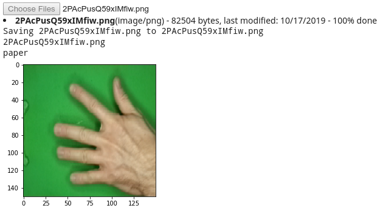
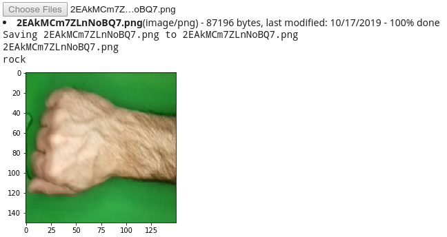
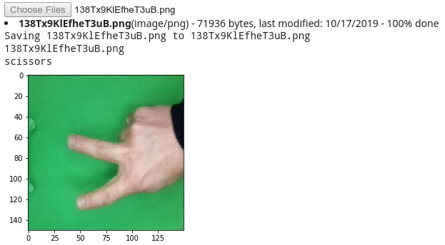

<p align="center"><a href=""></a></p>
<h1 align="center">Neural Network and Tensorflow</h1>


#### IMPORT LIBRARY
&emsp;```import tensorflow as tf``` <br>
&emsp;```import zipfile,os``` <br>
&emsp;```from tensorflow.keras.preprocessing.image import ImageDataGenerator``` <br>
&emsp;```import numpy as np``` <br>
&emsp;```from google.colab import files``` <br>
&emsp;```from keras.preprocessing import image``` <br>
&emsp;```import matplotlib.pyplot as plt``` <br>
&emsp;```import matplotlib.image as mpimg``` <br>
&emsp;```%matplotlib inline```

#### IMAGE TESTING




#### OTHER REFERENCE
* Cara download Kaggle dataset pada colab menggunakan [Kaggle API](https://www.kaggle.com/general/51898).
* Cara [tweak learning rate](https://machinelearningmastery.com/understand-the-dynamics-of-learning-rate-on-deep-learning-neural-networks/).
* Penggunaan [Augmentasi](https://machinelearningmastery.com/how-to-configure-image-data-augmentation-when-training-deep-learning-neural-networks/) gambar.
* Penggunaan [Padding dan Stride](https://machinelearningmastery.com/padding-and-stride-for-convolutional-neural-networks/) pada layer convolution.
* Penggunaan [Dropout Regularization](https://machinelearningmastery.com/dropout-regularization-deep-learning-models-keras/).
* Penggunaan [Custom Callback](https://keras.io/guides/writing_your_own_callbacks/).
* Penggunaan callback function untuk memplot hasil training model dengan [tensorboard](https://www.tensorflow.org/tensorboard/tensorboard_in_notebooks#tensorboard_in_notebooks).
* Penggunaan [LearningRateScheduler](https://www.tensorflow.org/api_docs/python/tf/keras/callbacks/LearningRateScheduler).
* Penggunaan [EarlyStopping](https://machinelearningmastery.com/how-to-stop-training-deep-neural-networks-at-the-right-time-using-early-stopping/).
* Penggunaan [Plot](https://machinelearningmastery.com/display-deep-learning-model-training-history-in-keras/) akurasi dan loss.
* Teknik transfer learning [InceptionV3](https://github.com/lmoroney/dlaicourse/blob/master/Exercises/Exercise%207%20-%20Transfer%20Learning/Exercise%207%20-%20Answer.ipynb).
